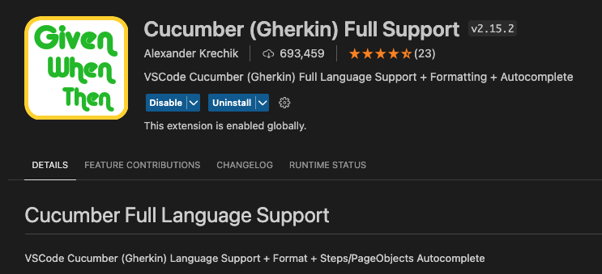
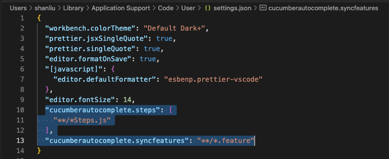

# Cypress with cucumber framework sample

## Setup

Make sure you have node install on your machine

### To install dependcies on this project

```
npm install
```

### To enable cucumber in your VS code

- Install this plugin in plugins market: Cucumber (Gherkin) Full Support
  
- Add below settings in your VS code `settings.json` file
  
- Reload your VS code app

## Test

To open test explorer

```
npx cypress open
```
